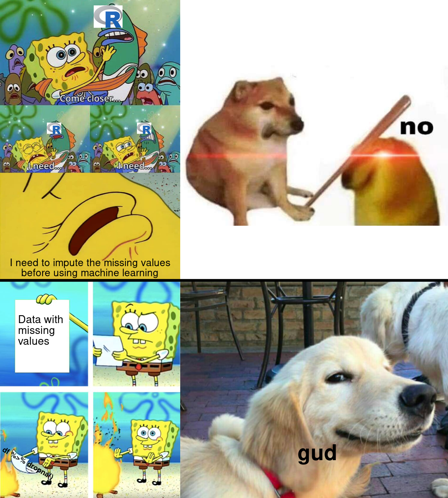

# Making Memes with R and the Magick Package

## My Meme I Made With R and Magick


## Motivation Behind the Meme
What motivated me to make such a _masterpiece of a meme_ was the fact that I was being assessed on my ability to create said meme for this course. Of course I wanted to do well so I thought hard about a good meme to create. A data science related meme (which I achieved to make) would have been _**even better**_. Haha of course I jest :trollface:. I wanted to practice using the R programming language and the magick package to see what my creativity and googling skills could create :art::grin:.

## What I Used to Make That Meme :point_up:
### Tools Used
The tools I used to make the meme were:
1. The **R** programming language _version 4.1.3_ (Can be downloaded at [this link](https://www.r-project.org/))
2. The **magick** R package ([Link to the package](https://cran.r-project.org/web/packages/magick/vignettes/intro.html))
3. The **graphics** package (included in base R)

### Source Code
```r
library(magick)

# from https://imgflip.com/memetemplate/240650289/I-need-spongebob
i_need_meme <- image_read("https://i.imgflip.com/3z9yy9.png") %>% 
    image_crop("1200x2000+0+200") %>%
    image_scale("500")

# from https://knowyourmeme.com/photos/1842748-go-to-horny-jail
no_dog <- image_read("https://i.kym-cdn.com/photos/images/newsfeed/001/842/748/23b") %>%
    image_scale("743") %>%
    image_extent("743x776", color = "white")

# from https://imgflip.com/memegenerator/139971723/Spongebob-Burning-Paper
burning_paper_meme <- image_read("https://i.imgflip.com/2bc2vf.jpg?a457635") %>% 
    image_scale("500")

# from https://knowyourmeme.com/photos/1908788-wholesome-memes
yes_dog <- image_read("https://i.kym-cdn.com/photos/images/newsfeed/001/908/788/652.png") %>%
    image_crop("550x350+50+100") %>%
    image_scale("743")

large_r_logo <- image_blank(width = 800, height = 620, color = "white") %>% 
    image_composite(image_read("images/R_logo.png")) %>%
    image_scale("80")

small_r_logo <- large_r_logo %>% image_scale("40")

edited_i_need_meme <- i_need_meme %>% 
    image_annotate("I need to impute the missing values\nbefore using machine learning", 
                   size = 28, 
                   gravity = "south", 
                   location = "+0+10", 
                   color = "black") %>%
    image_composite(large_r_logo, offset = "+260+15") %>% 
    image_composite(small_r_logo, offset = "+130+340") %>%
    image_composite(small_r_logo, offset = "+380+340")

top_level <- c(edited_i_need_meme, no_dog) %>% 
    image_append()

edited_burning_paper_meme <- burning_paper_meme %>%
    image_annotate("Data with\nmissing\nvalues", 
                   size = 30, 
                   location = "+50+120", 
                   color = "black") %>%
    image_annotate("df %>% dropna()", 
                   size = 20, 
                   color = "black",
                   degrees = 30,
                   font = "mono",
                   weight = 700,
                   location = "+5+475")

edited_yes_dog <- yes_dog %>% 
    image_annotate("gud", size = 60, color = "black", weight = 800, location = "+325+500")

bottom_level <- c(edited_burning_paper_meme, edited_yes_dog) %>% 
    image_append()

combined_meme <- c(top_level, bottom_level) %>%
    image_append(stack = TRUE)

final_meme <- image_draw(combined_meme)
abline(h = 777, col = "black", lwd = 10)

final_meme %>% image_write(path = "images/my_meme.png", format = "png")
```

## Why is the Meme Original?
1. It uses a similar format as the [**Drake yes/no**](https://knowyourmeme.com/memes/drakeposting) meme but with dogs
2. Uses a modified [**go to horny jail**](https://knowyourmeme.com/memes/go-to-horny-jail) meme as the "No" reaction
3. The go to horny jail has the [**laser eyes meme**](https://knowyourmeme.com/memes/glowing-eyes-laser-eyes) on it making it funnier
4. Uses 2 different popular Spongebob meme, in addition to [**Spongebob himself being a meme**](https://knowyourmeme.com/memes/subcultures/spongebob-squarepants)
    1. The [**Come Closer I Need**](https://knowyourmeme.com/memes/come-closer-i-need) Spongebob meme
    2. The **Spongebob burning paper meme**
5. "Gud" is spelt in a funny way
5. It is data science related with a reference to R and the need to handle missing data in an appropriate way
6. The meme actually does not recommend an appropriate way to handle missing data but instead recommends to just drop all rows that contain missing values. This potentially increases the issues with the data and may introduce bias
7. Mentioning machine learning has been a trend these days so I also did :)

In total, my glorious piece of art uses six different meme references all in one and makes funny references to data science practices, something the world has never seen before 🔥.
